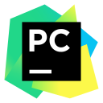
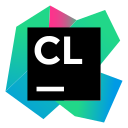

<h3 align="center">
Hi there, my name is Jordan Daudu  
</h3>

<h2 align="left" id="JordanDaudu">🙋‍♂️ About Me</h2>

Hi, I'm a <strong>Software Engineering student</strong> at <strong>Sami Shamoon College of Engineering</strong>. 
I'm focused on building full-stack applications, backend systems, and clean software architectures using technologies such as Java, Spring Boot, PostgreSQL, Docker, and cloud-ready development workflows.

  🐳 Docker enthusiast 
  ⚙️ Interested in CI/CD, automation, and clean delivery workflows 
  🏠 Exploring self-hosting and homelab setups 
  📚 Always learning, building, and improving

<h2 align="left" id="JordanDaudu">💻 Dev-Hub</h2>

> Programming Languages

<table>
  <tr>
    <td align="center" width="96">
      
       Python
    </td>
    <td align="center" width="96">
      
       Java
    </td>
    <td align="center" width="96">
      
       C++
    </td>
    <td align="center" width="96">
      
       C#
    </td>
    <td align="center" width="96">
      
       GDScript
    </td>
  </tr>
</table>

> Backend & Databases

<table>
  <tr>
    <td align="center" width="96">
      
       Java Backend
    </td>
    <td align="center" width="96">
      
       Spring Boot
    </td>
    <td align="center" width="96">
      
       PostgreSQL
    </td>
  </tr>
</table>

> Frontend Basics

<table>
  <tr>
    <td align="center" width="96">
      
       HTML
    </td>
    <td align="center" width="96">
      
       CSS
    </td>
  </tr>
</table>

> DevOps & Version Control

<table>
  <tr>
    <td align="center" width="96">
      
       Docker
    </td>
    <td align="center" width="96">
      
       Git
    </td>
    <td align="center" width="96">
      
       GitHub
    </td>
  </tr>
</table>

> Tools & IDEs

<table>
  <tr>
    <td align="center" width="96">
      
       VS Code
    </td>
    <td align="center" width="96">
      
       IntelliJ
    </td>
    <td align="center" width="96">
      
       PyCharm
    </td>
    <td align="center" width="96">
      
       CLion
    </td>
    <td align="center" width="96">
      
       WebStorm
    </td>
  </tr>
  <tr>
    <td align="center" width="96">
      
       Replit
    </td>
    <td align="center" width="96">
      
       Jira
    </td>
    <td align="center" width="96">
      
       Qase
    </td>
  </tr>
</table>

> AI Tools

<table>
  <tr>
    <td align="center" width="96">
      
       ChatGPT
    </td>
    <td align="center" width="96">
      
       Copilot
    </td>
    <td align="center" width="96">
      
       Gemini
    </td>
    <td align="center" width="96">
      
       Claude
    </td>
    <td align="center" width="96">
      
       Cursor
    </td>
  </tr>
  <tr>
    <td align="center" width="96">
      
       Perplexity
    </td>
  </tr>
</table>

<h2 align="left" id="JordanDaudu">⌨️ I’m working on</h2>

- Actively developing **Nomad Protocol: Aeterra**, a top-down shooter in Unity focused on modular system design, enemy behaviors, combat architecture, and scalable gameplay features.
- You can also explore the project further on my [website](https://nomad-protocol-aeterra.onrender.com/), where I present its world, direction, and overall vision.  
It offers a broader showcase of the project beyond the repository, including its style, systems, and ongoing development.
 

---

### 📫 How to reach me

<table>
  <tr>
    <td align="center" width="96">
      
       Gmail
    </td>
    <td align="center" width="96">
      
       Linkedin
    </td>
  </tr>
</table>

  
